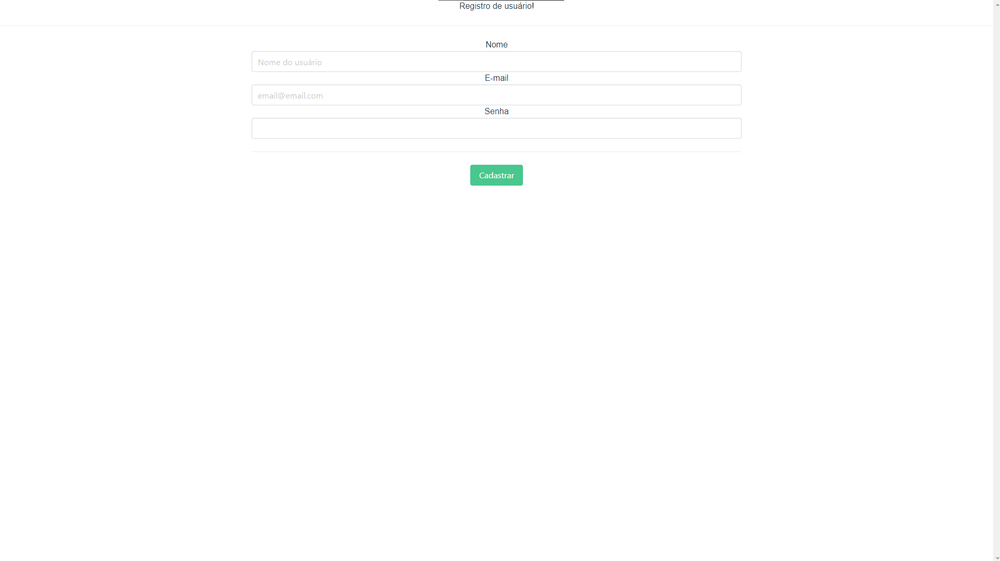

# Backend-e-Integra-o-com-Vue

#Backend desenvolvido com MySQL, Sequelize, Node.js, Express.js, Axios, Authenticate, JWT.
#Front-end desenvolvido com JavaScrip, CSS, HTML, Bulma e Vue.

# Recursos

* O aplicativo foi desenvolvido com MySQL, Sequelize, Node.js, Express.js, Axios, Authenticate, JWT, JavaScrip, CSS, HTML, Bulma e Vue.

# Uso

1. Clone o repositório do GitHub.
2. Abra o projeto no seu editor de código.
3. Instale o pacote do projeto com npm install(É necessário MySQL instalado), tanto front-end quanto o backend.
4. Inicie o MySQL Workbench.
5. Depois de instalado os pacotes, basta dar um npm start no front e no backend para iniciar o projeto na porta localhost:8080 e o servidor na porta 8686 respectivamente.

# Créditos

Este projeto foi criado por Alaska Websites.
